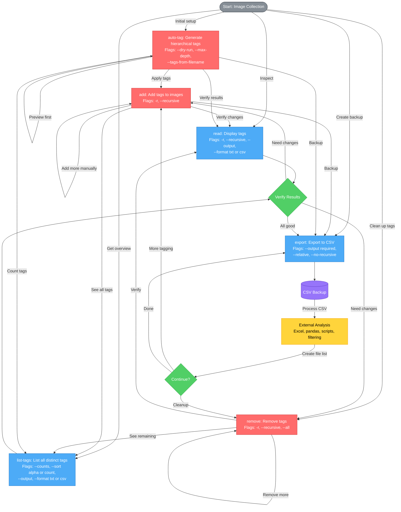

# **Image Tagger**

## members:
- Syed Hanzala Ali (24k-0025)
- Rafay Siddiqui (24k-0009)

Lightweight, offline CLI tool for managing image collections through embedded XMP metadata tags.

---

## **Features**

- ✅ **Portable:** Tags embedded in images, not databases
- ✅ **Offline:** No internet or cloud required
- ✅ **Non-destructive:** Original images never moved
- ✅ **Cross-platform:** Windows, macOS, Linux

---

## **Installation**

```bash
# Clone repository
git clone https://github.com/yourusername/image-tagger.git 
cd image-tagger

# Install dependencies
pip install pyexiv2

# Verify installation
python tagger.py --help
```

---


## command graph



## command map

```bash
# ============================================================================
# IMAGE TAGGER - ALL POSSIBLE COMMAND COMBINATIONS
# ============================================================================

# ----------------------------------------------------------------------------
# 1. ADD - Add tags to images
# ----------------------------------------------------------------------------
tagger.py add <path> <tag1> [tag2 tag3 ...]
tagger.py add <path> <tag1> [tag2 tag3 ...] --recursive

# Examples:
tagger.py add photo.jpg nature landscape
tagger.py add photos/ wallpaper --recursive
tagger.py add photos/*.jpg sunset beach
tagger.py add photos/Nature/ nature trees --recursive

# ----------------------------------------------------------------------------
# 2. REMOVE - Remove tags from images
# ----------------------------------------------------------------------------
tagger.py remove <path> <tag1> [tag2 tag3 ...]
tagger.py remove <path> <tag1> [tag2 tag3 ...] --recursive
tagger.py remove <path> --all
tagger.py remove <path> --all --recursive

# Examples:
tagger.py remove photo.jpg old_tag deprecated
tagger.py remove photos/ unwanted --recursive
tagger.py remove photo.jpg --all
tagger.py remove photos/ --all --recursive
tagger.py remove photos/*.png test_tag

# ----------------------------------------------------------------------------
# 3. READ - Display tags from images
# ----------------------------------------------------------------------------
tagger.py read <path>
tagger.py read <path> --recursive
tagger.py read <path> --output <file.txt>
tagger.py read <path> --output <file.txt> --recursive
tagger.py read <path> --format txt
tagger.py read <path> --format txt --recursive
tagger.py read <path> --format txt --output <file.txt>
tagger.py read <path> --format txt --output <file.txt> --recursive
tagger.py read <path> --format csv --output <file.csv>
tagger.py read <path> --format csv --output <file.csv> --recursive

# Examples:
tagger.py read photo.jpg
tagger.py read photos/ --recursive
tagger.py read photos/ --output tags.txt --recursive
tagger.py read photos/*.jpg --format csv --output tags.csv

# ----------------------------------------------------------------------------
# 4. LIST-TAGS - List all distinct tags in collection
# ----------------------------------------------------------------------------
tagger.py list-tags <path>
tagger.py list-tags <path> --counts
tagger.py list-tags <path> --sort alpha
tagger.py list-tags <path> --sort count
tagger.py list-tags <path> --counts --sort alpha
tagger.py list-tags <path> --counts --sort count
tagger.py list-tags <path> --output <file.txt>
tagger.py list-tags <path> --output <file.txt> --counts
tagger.py list-tags <path> --output <file.txt> --counts --sort alpha
tagger.py list-tags <path> --output <file.txt> --counts --sort count
tagger.py list-tags <path> --format txt
tagger.py list-tags <path> --format txt --counts
tagger.py list-tags <path> --format txt --counts --sort alpha
tagger.py list-tags <path> --format txt --counts --sort count
tagger.py list-tags <path> --format txt --output <file.txt>
tagger.py list-tags <path> --format txt --output <file.txt> --counts
tagger.py list-tags <path> --format txt --output <file.txt> --counts --sort alpha
tagger.py list-tags <path> --format txt --output <file.txt> --counts --sort count
tagger.py list-tags <path> --format csv --output <file.csv>
tagger.py list-tags <path> --format csv --output <file.csv> --counts
tagger.py list-tags <path> --format csv --output <file.csv> --counts --sort alpha
tagger.py list-tags <path> --format csv --output <file.csv> --counts --sort count

# Examples:
tagger.py list-tags photos/
tagger.py list-tags photos/ --counts
tagger.py list-tags photos/ --counts --sort count
tagger.py list-tags photos/ --output all_tags.txt --counts
tagger.py list-tags photos/ --format csv --output tags.csv

# ----------------------------------------------------------------------------
# 5. AUTO-TAG - Generate hierarchical tags from folder structure
# ----------------------------------------------------------------------------
tagger.py auto-tag <path>
tagger.py auto-tag <path> --dry-run
tagger.py auto-tag <path> --max-depth <N>
tagger.py auto-tag <path> --max-depth <N> --dry-run
tagger.py auto-tag <path> --tags-from-filename
tagger.py auto-tag <path> --tags-from-filename --dry-run
tagger.py auto-tag <path> --tags-from-filename --max-depth <N>
tagger.py auto-tag <path> --tags-from-filename --max-depth <N> --dry-run

# Examples:
tagger.py auto-tag photos/
tagger.py auto-tag photos/ --dry-run
tagger.py auto-tag photos/ --max-depth 2
tagger.py auto-tag photos/ --tags-from-filename
tagger.py auto-tag photos/ --tags-from-filename --max-depth 3 --dry-run

# ----------------------------------------------------------------------------
# 6. EXPORT - Export all image paths and tags to CSV
# ----------------------------------------------------------------------------
tagger.py export <path> --output <file.csv>
tagger.py export <path> --output <file.csv> --relative
tagger.py export <path> --output <file.csv> --no-recursive
tagger.py export <path> --output <file.csv> --relative --no-recursive

# Examples:
tagger.py export photos/ --output all_tags.csv
tagger.py export photos/ --output backup.csv --relative
tagger.py export photos/Wallpapers/ --output wallpapers.csv --no-recursive
tagger.py export photos/ --output tags.csv --relative --no-recursive

# ============================================================================
# PARAMETER REFERENCE
# ============================================================================

# <path>
#   - Single file:        photo.jpg
#   - Directory:          photos/
#   - Glob pattern:       photos/*.jpg
#   - Nested directory:   photos/Nature/Mountains/

# <tag1> <tag2> ...
#   - One or more tags:   nature landscape 4k wallpaper
#   - Tags with text:     "my tag" (if spaces needed, use quotes)

# --recursive, -r
#   - Recursively search all subdirectories
#   - Available for: add, remove, read

# --all
#   - Remove ALL tags from image(s)
#   - Available for: remove

# --output <file>
#   - Save output to file instead of console
#   - Available for: read, list-tags
#   - File can be .txt or .csv

# --format <txt|csv>
#   - Output format
#   - Available for: read, list-tags
#   - Default: txt

# --counts
#   - Show image count per tag
#   - Available for: list-tags

# --sort <alpha|count>
#   - Sort order: alphabetically or by count
#   - Available for: list-tags
#   - Default: alpha

# --dry-run
#   - Preview changes without writing
#   - Available for: auto-tag

# --max-depth <N>
#   - Limit folder hierarchy depth
#   - Available for: auto-tag
#   - Example: --max-depth 2 (only 2 levels deep)

# --tags-from-filename
#   - Extract tags from filename (split by - and _)
#   - Available for: auto-tag

# --relative
#   - Use relative paths in output
#   - Available for: export

# --no-recursive
#   - Disable recursive scanning (only scan top level)
#   - Available for: export

# ============================================================================
# COMMON WORKFLOW COMBINATIONS
# ============================================================================

# Initial Setup Workflow
tagger.py auto-tag photos/ --dry-run                    # Preview
tagger.py auto-tag photos/ --tags-from-filename         # Apply
tagger.py add photos/favorites/ favorite --recursive    # Manual additions
tagger.py export photos/ --output backup.csv            # Backup

# Tag Management Workflow
tagger.py list-tags photos/ --counts --sort count       # See popular tags
tagger.py remove photos/ old_tag deprecated --recursive # Clean up
tagger.py read photos/ --recursive                      # Verify

# Backup & Analysis Workflow
tagger.py export photos/ --output backup.csv --relative # Export
# [Process CSV externally with Excel/pandas/scripts]
tagger.py read photos/ --format csv --output current.csv --recursive # Compare

# Inspection Workflow
tagger.py read photo.jpg                                # Single image
tagger.py read photos/ --recursive --output all.txt     # All images
tagger.py list-tags photos/ --counts --output tags.txt  # Tag overview

# Hierarchical Tagging Workflow
tagger.py auto-tag photos/ --max-depth 2 --dry-run     # Preview limited depth
tagger.py auto-tag photos/ --max-depth 2               # Apply limited depth
tagger.py list-tags photos/ --counts                   # Verify hierarchy

# Filename Tagging Workflow
tagger.py auto-tag photos/ --tags-from-filename --dry-run  # Preview filename tags
tagger.py auto-tag photos/ --tags-from-filename            # Apply filename tags
tagger.py list-tags photos/ --counts --sort count          # See all tags

```


## **Quick Start**

```bash
# Tag an image
python tagger.py add photos/vacation.jpg travel beach sunset

# List all tags
python tagger.py list-tags photos/

# Export tags to CSV
python tagger.py export photos/ --output backup.csv
```

---

## **Command Reference**

### **1. Add Tags**

Add custom tags to images.

```bash
# Single image
python tagger.py add photos/image.jpg nature landscape 4k

# Multiple images with glob pattern
python tagger.py add photos/*.jpg wallpaper

# Recursive (all images in folder)
python tagger.py add photos/Nature/ nature --recursive
```

**Output:**
```
Adding tags ['nature', 'landscape', '4k'] to 1 image(s)...
  [✓] image.jpg: ['4k', 'landscape', 'nature']

Summary: Successfully tagged 1/1 images.
```

---

### **2. Remove Tags**

Remove specific or all tags from images.

```bash
# Remove specific tags
python tagger.py remove photos/image.jpg old_tag unwanted

# Remove all tags
python tagger.py remove photos/image.jpg --all

# Remove from multiple images recursively
python tagger.py remove photos/ deprecated_tag --recursive
```

**Output:**
```
Removing tags ['old_tag', 'unwanted'] from 1 image(s)...
  [✓] image.jpg: ['landscape', 'nature']

Summary: Successfully modified 1/1 images.
```

---

### **3. Read Tags**

Display tags from image(s).

```bash
# Single image (console)
python tagger.py read photos/image.jpg

# Multiple images recursively
python tagger.py read photos/ --recursive

# Export to text file
python tagger.py read photos/image.jpg --output tags.txt

# Export to CSV
python tagger.py read photos/ --format csv --output tags.csv --recursive
```

**Console Output:**
```
image.jpg: nature,landscape,4k
```

**tags.txt:**
```
image.jpg: nature,landscape,4k
```

**tags.csv:**
```csv
filename,tags
"image.jpg","nature,landscape,4k"
```

---

### **4. List All Tags**

Show all distinct tags across collection.

```bash
# Basic list (console)
python tagger.py list-tags photos/

# With image counts
python tagger.py list-tags photos/ --counts

# Sort by popularity
python tagger.py list-tags photos/ --counts --sort count

# Export to text file
python tagger.py list-tags photos/ --output all_tags.txt --counts

# Export to CSV
python tagger.py list-tags photos/ --output tags.csv --format csv
```

**Console Output:**
```
Scanning photos/ for tags...
All distinct tags:
━━━━━━━━━━━━━━━━━━━━━━━━━━━━━━━━━━
4k                 (12 images)
beach              (8 images)
landscape          (15 images)
nature             (18 images)
travel             (10 images)
━━━━━━━━━━━━━━━━━━━━━━━━━━━━━━━━━━
Total: 5 distinct tags
Scanned: 88 images (85 tagged)
```

**tags.csv:**
```csv
tag,count
4k,12
beach,8
landscape,15
nature,18
travel,10
```

---

### **5. Auto-tag from Folders**

Generate hierarchical tags from folder structure and optionally from filenames.

```bash
# Auto-tag all images from folder structure
python tagger.py auto-tag photos/

# Preview without applying
python tagger.py auto-tag photos/ --dry-run

# Limit hierarchy depth
python tagger.py auto-tag photos/ --max-depth 2

# Include tags from filename (split by - or _)
python tagger.py auto-tag photos/ --tags-from-filename
```

**Example:**
```
Before: photos/Wallpapers/Nature/Mountains/peak.jpg
After:  Tags: [wallpapers, nature, mountains, wallpapers/nature, wallpapers/nature/mountains]
```

**Output:**
```
[AUTO-TAG] Scanning photos/ recursively...
Found 88 images.

Processing:
  photos/Wallpapers/Nature/peak.jpg
    Tags: ['nature', 'wallpapers', 'wallpapers/nature']
  
Summary:
  • Images processed: 88
  • Unique tag chains: 11
  • Total tags added: 184
  • Average tags per image: 2.1
```

**With --tags-from-filename:**

For a file `photos/Ireland/20230317-BallyvooneyCove_ROW5905528136_UHD.jpg`:

Generated tags include:
- Folder tags: `ireland`, `ireland` (hierarchical)
- Filename tags: `20230317`, `ballyvooneycove`, `row5905528136`, `uhd`

---

### **6. Export Tags**

Export all image paths and tags to CSV.

```bash
# Export all tags (recursive by default)
python tagger.py export photos/ --output all_tags.csv

# Export with relative paths
python tagger.py export photos/ --output tags.csv --relative

# Export specific folder (no recursion)
python tagger.py export photos/Wallpapers/ --output wallpapers.csv --no-recursive
```

**all_tags.csv:**
```csv
filepath,tags
photos/Wallpapers/Nature/image1.jpg,"wallpapers,wallpapers/nature,4k"
photos/Personal/Travel/beach.jpg,"personal,personal/travel,beach,sunset"
photos/Projects/logo.jpg,"projects,branding"
```

**With --relative flag:**
```csv
filepath,tags
Wallpapers/Nature/image1.jpg,"wallpapers,wallpapers/nature,4k"
Personal/Travel/beach.jpg,"personal,personal/travel,beach,sunset"
Projects/logo.jpg,"projects,branding"
```

---

## **Common Workflows**

### **Workflow 1: Initial Setup**

```bash
# 1. One-time auto-tag from existing folder structure
python tagger.py auto-tag photos/ --tags-from-filename

# 2. Add manual tags to specific images
python tagger.py add photos/favorites/*.jpg favorite --recursive

# 3. Export backup
python tagger.py export photos/ --output backup.csv
```

---

### **Workflow 2: Tag Management**

```bash
# 1. List all existing tags with counts
python tagger.py list-tags photos/ --counts --sort count

# 2. Remove deprecated tags
python tagger.py remove photos/ old_tag deprecated --recursive

# 3. Verify changes
python tagger.py read photos/ --recursive
```

---

### **Workflow 3: Backup & Restore**

```bash
# Create backup
python tagger.py export photos/ --output backup.csv --relative

# After changes, compare
python tagger.py list-tags photos/ --output current_tags.txt --counts

# Read specific images to verify
python tagger.py read photos/subfolder/ --recursive
```

---

## **CSV Formats**

### **Tag Export (from `export` command):**
```csv
filepath,tags
photos/image1.jpg,"wallpapers,nature,4k"
photos/image2.png,"personal,travel,beach"
```

### **Tag List with Counts (from `list-tags --format csv`):**
```csv
tag,count
nature,18
wallpapers,12
travel,10
beach,8
4k,12
```

### **Read Tags Output (from `read --format csv`):**
```csv
filename,tags
"image1.jpg","nature,landscape,4k"
"image2.png","travel,beach"
```

---

## **Supported Formats**

- JPEG (`.jpg`, `.jpeg`)
- PNG (`.png`)
- WebP (`.webp`)
- TIFF (`.tiff`, `.tif`)

---

## **Requirements**

- Python 3.10+
- `pyexiv2` library

---

## **FAQ**

**Q: Where are tags stored?**  
A: In XMP metadata (`Xmp.dc.subject` field) embedded in image files.

**Q: Are original images modified?**  
A: Only metadata is modified. Image data is never changed.

**Q: Can I use this with Lightroom/other tools?**  
A: Yes! XMP tags are standard and readable by Adobe products and most image software.

**Q: Can I run this on Windows?**  
A: Yes. The tool automatically handles Windows long path names. Use either backslashes or forward slashes for paths.

**Q: What does auto-tag with --tags-from-filename do?**  
A: It parses the filename, splits by hyphens (-) and underscores (_), and adds tokens longer than 2 characters as tags (converted to lowercase).

**Q: How does hierarchical tagging work?**  
A: For path `photos/A/B/C/image.jpg`, auto-tag creates both individual tags (`a`, `b`, `c`) and hierarchical tags (`a`, `a/b`, `a/b/c`).

---